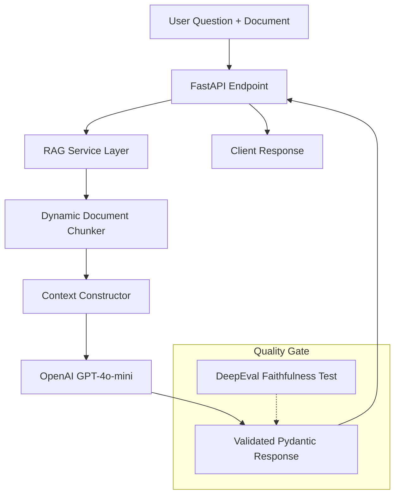

# RAG Document QA API


A production-grade, context-aware RAG (Retrieval-Augmented Generation) API. It uses dynamic text chunking and GPT-4o-mini to provide highly accurate, document-based answers. Designed with a focus on **Reliability**, **Modular Architecture**, and **Automated AI Evaluation**.

## Architecture

This system follows a modular service-oriented architecture to separate concerns and ensure scalability.



## Core Features
- **Smart Chunking:** Efficiently splits long documents to fit LLM context windows while maintaining semantic integrity.
- **Strict Compliance:** Instructed to answer ONLY based on provided context to eliminate hallucinations.
- **Async Processing:** Built on `FastAPI` and `AsyncOpenAI` for high-concurrency performance.
- **Enterprise Tooling:** Fully containerized with Docker and automated via Makefile.
- **Automated AI Evals:** Integrated `DeepEval` suite to measure **Faithfulness** and **Answer Relevancy**.

## Prerequisites
- [uv](https://astral.sh/uv) (Extremely fast Python package manager)
- `make` (Workflow automation)
- Docker & Docker Compose (Containerization)

## Usage

### Local Development
```bash
make setup    # Install dependencies
make dev      # Prepare environment (sync + pre-commit)
make test     # Execute all tests (Integration + AI Evals)
make lint     # Enforce code quality via Ruff
```

### Docker Orchestration
Experience the full production environment in seconds:
```bash
make up       # Build and start container
make down     # Stop and clean up
```

### Interactive Documentation
Once the server is running, explore the API via Swagger UI:
- **URL:** `http://localhost:8000/docs`

## API Reference

### POST `/rag-query`
Queries a specific document and returns a validated answer.

**Request Body:**
```json
{
  "document_text": "The corporate policy allows for 20 days of annual leave...",
  "question": "How many days of leave can I take?"
}
```

**Response Example:**
```json
{
  "answer": "You are entitled to 20 days of annual leave per year.",
  "chunks_used": 1,
  "processing_time_ms": 1150
}
```

## AI Quality Evaluation
We don't just write code; we ensure AI reliability. This project includes an automated evaluation suite:
- **Faithfulness Metric:** Ensures the AI is "honest" and doesn't invent information outside the document.
- **Answer Relevancy:** Measures how well the AI actually addresses the user's specific question.

Run evals: `make test`

---
**Flagship Standard:** Modular Design | DeepEval | Async-First | Dockerized
