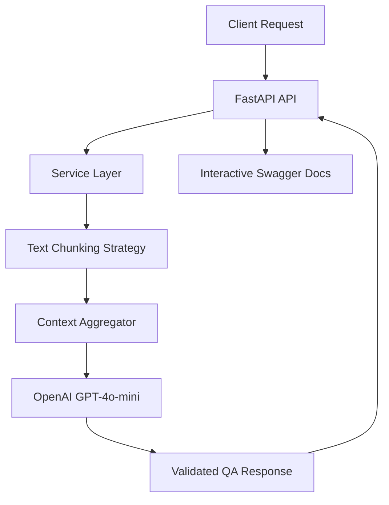

# RAG Document QA API


Professional Context-aware RAG API for document Q&A using GPT-4o-mini with dynamic text chunking strategies. Built for enterprise-grade document analysis and automated compliance.

## Architecture



## Features
- **Dynamic Chunking:** Automatically splits long documents into manageable segments.
- **Context-Aware:** Answers questions strictly based on provided document context.
- **Production-Ready:** Includes Docker orchestration, Makefiles, and GitHub Actions CI.
- **Interactive Documentation:** Ready-to-use Swagger UI for API testing.

## Prerequisites
- [uv](https://astral.sh/uv)
- `make`
- Docker (optional)

## Usage

### Local Development
```bash
make install # Setup environment
make dev     # Install pre-commit hooks
make test    # Run API & Eval tests
```

### Docker Execution
```bash
make up
```

### Interactive API Documentation
Once the server is running, explore and test the API directly at:
- **Swagger UI:** `http://localhost:8000/docs`

## API Examples

### Ask Questions About Documents
**Endpoint:** `POST /rag-query`

**Request:**
```bash
curl -X POST http://localhost:8000/rag-query \
  -H "Content-Type: application/json" \
  -d '{
    "document_text": "ExampleCorp specializes in AI automation. The CEO is John Doe.",
    "question": "Who is the CEO of ExampleCorp?"
  }'
```

**Response:**
```json
{
  "answer": "The CEO of ExampleCorp is John Doe.",
  "chunks_used": 1,
  "processing_time_ms": 1240
}
```

## Development
To contribute and maintain code quality, ensure you run `make dev` to setup the pre-commit guards.

---
**Standard:** Modular Architecture | DeepEval | Async FastAPI
