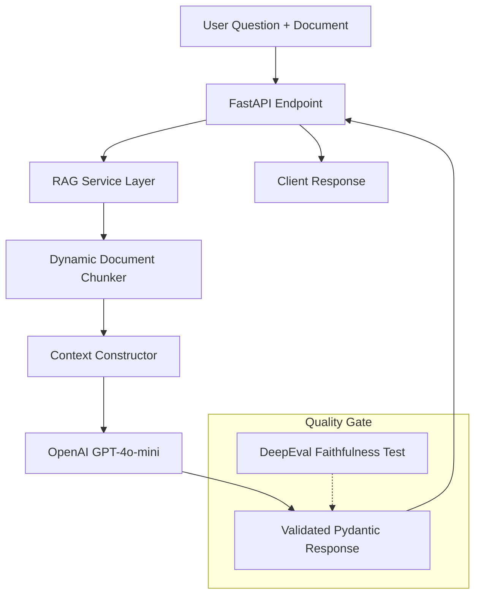

# RAG Document QA API


A production-grade, context-aware RAG (Retrieval-Augmented Generation) API. This service utilizes dynamic text chunking and GPT-4o-mini to provide accurate, document-grounded answers. It is built with a focus on reliability, modular architecture, and automated AI evaluation.

## Architecture

This system follows a modular service-oriented architecture to separate concerns and ensure scalability.



## Core Features
- **Smart Chunking:** Efficiently splits long documents into manageable segments to fit LLM context windows while maintaining semantic integrity.
- **Context-Aware Integrity:** Instructed to answer strictly based on provided context to eliminate hallucinations.
- **Asynchronous Processing:** Built using FastAPI and AsyncOpenAI for high-concurrency performance.
- **Enterprise Ready:** Fully containerized with Docker and workflow-automated via Makefile.
- **AI Evaluation Suite:** Integrated DeepEval suite to measure Faithfulness and Answer Relevancy.

## Prerequisites
- uv
- make
- Docker and Docker Compose (optional)

## Usage

### Local Development
```bash
make setup    # Install all dependencies
make dev      # Prepare development environment with pre-commit hooks
make test     # Execute all tests including Integration and AI Evaluations
make lint     # Enforce code quality and formatting via Ruff
```

### Docker Orchestration
Run the production-ready environment using containers:
```bash
make up       # Build and start the application container
make down     # Stop and remove containers
```

### Interactive Documentation
Explore the API interactively via Swagger UI:
- URL: http://localhost:8000/docs

## API Reference

### POST /rag-query
Analyzes the provided document and answer questions based on its content.

**Request Body:**
```json
{
  "document_text": "The corporate policy allows for 20 days of annual leave per calendar year. Requests must be submitted at least two weeks in advance.",
  "question": "How many days of leave can I take?"
}
```

**Response Payload:**
```json
{
  "answer": "You are entitled to 20 days of annual leave per calendar year.",
  "chunks_used": 1,
  "processing_time_ms": 1150
}
```

## AI Quality Evaluation
We ensure AI reliability through an automated evaluation suite:
- **Faithfulness Metric:** Verifies that the AI stays honest and does not invent information outside the document context.
- **Answer Relevancy:** Measures how accurately the AI addresses the user's specific query.

Run the evaluation suite: `make test`

---
**Standard:** Modular Design | DeepEval | Async-First | Dockerized
